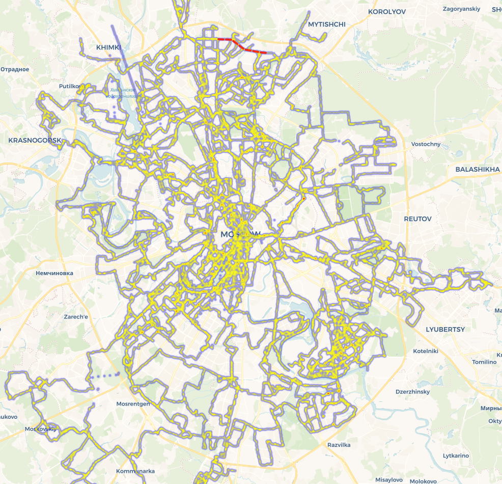

# Heatmap маршрутов из GPX-файлов
Визуализация популярных маршрутов Москвы катания на роликовых коньках с учётом ограничений движения (разрушенный асфальт, ремонтные работы).

## Как это работает
Скрипт (`main.py`):
1. **Парсит GPX-файлы**:
   - Треки из папки `TRACKS_DIR` (маршруты катания)
   - Ограничения из папки `RESTRICTIONS_DIR` (проблемные участки)
2. **Генерирует интерактивную карту**:
   - Строит heatmap на основе треков
   - Отмечает зоны ограничений поверх heatmap
3. **Сохраняет результат** в `index.html` и автоматически открывает в браузере.

## Источники данных
- **Треки**: публичные активности из роллерских сообществ Strava (с мая 2025)
- **Ограничения**: созданы вручную через [Яндекс.Конструктор карт](https://yandex.ru/map-constructor/) и экспортированы в GPX
## Как запустить
1) собрать GPX-файлы в папки TRACKS_DIR и RESTRICTIONS_DIR;
2) запустить main.py для создания карты;
3) использовать получившийся index.html

## Быстрый старт
1. Подготовьте GPX-файлы:
   - Треки → положите в `./tracks/`
   - Ограничения → в `./tracks/restrictions/`
2. Запустите скрипт:
   ```bash
   python3 main.py
3. Результат будет сохранён в `index.html` (автоматически откроется в браузере).
   
## Пример   
  
> Карта построена на основе 100+ треков из сообществ Strava. Красным пунктиром отмечены участки с разрушенным асфальтом.

## Возможные улучшения
Добавить фильтрацию по дате треков.

Автоматическое определение "плохого асфальта" по резким замедлениям.