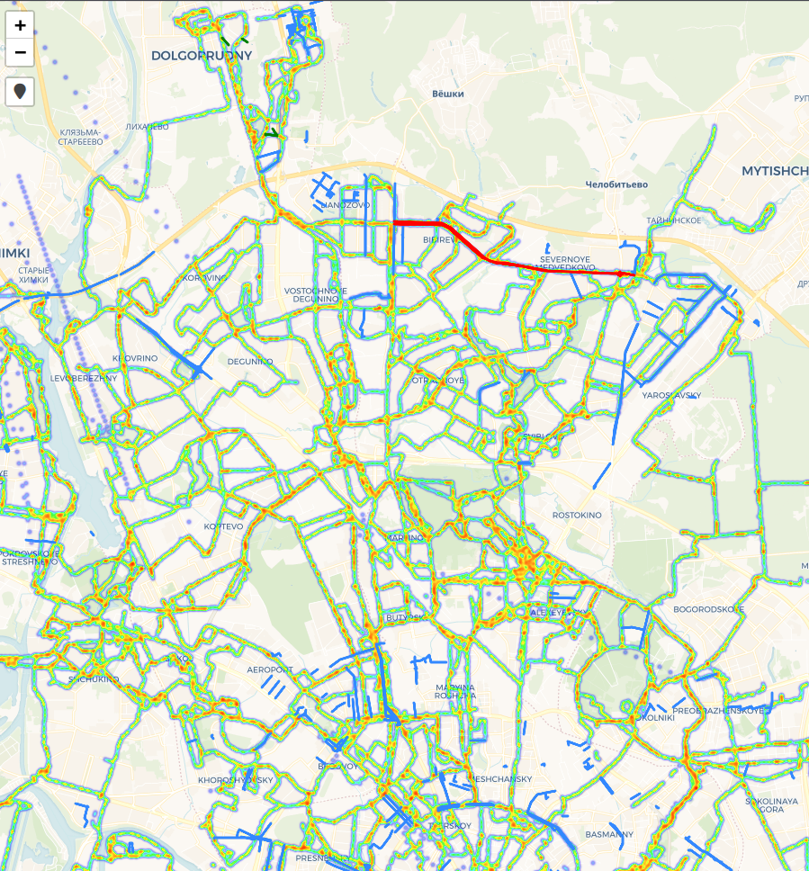

# Heatmap маршрутов из GPX-файлов
Визуализация популярных маршрутов Москвы катания на роликовых коньках с учётом ограничений движения (разрушенный асфальт, ремонтные работы). Отображается геолокация устройства пользователя.

## Как это работает
Скрипт (`main.py`):
1. **Парсит GPX-файлы**:
   - Треки из папки `TRACKS_DIR` (маршруты катания)
   - Ограничения из папки `RESTRICTIONS_DIR` (проблемные участки)
2. **Генерирует интерактивную карту**:
   - Строит heatmap на основе треков
   - Отмечает зоны ограничений поверх heatmap
3. **Сохраняет результат** в `index.html` и автоматически открывает в браузере.

## Источники данных
- **Треки**: публичные активности из роллерских сообществ Strava (с мая 2025)
- **Запланированные и идущие дорожные ремонтные работы**: https://data.mos.ru/opendata/62101/map?version=3&release=2, выделены синим
- **Ограничения**: 1) созданы вручную через [Яндекс.Конструктор карт](https://yandex.ru/map-constructor/) и экспортированы в GPX; 2) перечислением global_id с карты https://data.mos.ru/opendata/62101/map?version=3&release=2 для улиц с проблемным проездом, выделены красным.
- **Новый асфальт**: перечислением global_id с карты https://data.mos.ru/opendata/62101/map?version=3&release=2 для улиц с обновленным тротуаром без проблем с проездом, выделены зеленым.

## Как запустить
1) собрать GPX-файлы в папки TRACKS_DIR и RESTRICTIONS_DIR;
2) запустить main.py для создания карты;
3) использовать получившийся index.html

## Быстрый старт
1. Подготовьте GPX-файлы:
   - Треки → положите в `./tracks/`
   - Ограничения → в `./tracks/restrictions/`
2. Запустите скрипт:
   ```bash
   python3 main.py
3. Результат будет сохранён в `index.html` (автоматически откроется в браузере).
   
## Пример   
  
> Карта построена на основе 100+ треков из сообществ Strava. Красным отмечены участки с разрушенным асфальтом, зеленым с новым асфальтом на тротуарах, синим - идущие по данным горслужб мск дорожные работы. Отображается геолокация устройства пользователя.

## Возможные улучшения
Добавить фильтрацию по дате треков.

Автоматическое определение "плохого асфальта" по резким замедлениям.

# Похожие ресурсы
https://yandex.ru/maps/-/CHXJUHJ8 Ремонты 2025